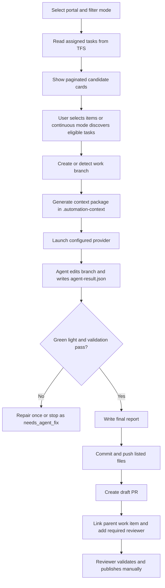

# TFS Documentation Automation MVP - Technical Design

## 1. Context

At the start of each sprint, a documentation team member follows the product team's planning session and validates which work items require new documentation, changes to existing documentation, or no documentation action. Many work items are small bugs or minor terminology changes where the manual validation cost is higher than the final documentation change.

The goal of this MVP is to create an LLM-assisted pipeline, using the tools available in the company environment, to reduce time spent on triage and on preparing small documentation changes.

## 2. MVP Goal

Create a centralized Content AI automation application that can:

1. Read tasks assigned to the Content team from TFS.
2. Present a filterable list of work items that may have documentation impact.
3. Allow manual selection of candidates or continuous background discovery.
4. Prepare one branch per selected work item for LLM-assisted documentation changes.
5. Launch an approved provider against the selected work branch.
6. Wait for a green-lighted agent result.
7. Commit, push, and create a draft PR with the required reviewer and linked work item.
8. Provide read-only Cherry Pick propagation analysis from the same dashboard.

The MVP prioritizes human control, traceability, durable background execution, and low operational risk.

## 3. Initial Non-Goals

The MVP must not:

- merge or cherry-pick changes;
- update work items in TFS;
- publish documentation;
- run LLM-generated changes directly in shared branches;
- assume that every work item needs documentation.
- create final or published PRs; draft PRs are allowed only after a selected automatic flow has a valid green-lighted agent result and the dashboard has pushed the work branch.

## 4. Cherry Picks Dashboard Integration

The previous Cherry Picks dashboard provided useful components:

- TFS/Azure DevOps Server client;
- Windows Credentials, PAT, and Git-credential-oriented authentication patterns;
- portal/repository configuration;
- PR and work item reads;
- simple Streamlit UI for internal operations.

The current project keeps the old Streamlit dashboard as a reference and exposes the useful propagation logic as a FastAPI/Jinja page:

```text
tfs-doc-automation-mvp
  doc_automation/
    cherry_picks.py       read-only propagation analysis service
    tfs_client.py         shared TFS/Azure DevOps Server client
    services.py           application service layer
    web.py                FastAPI routes
  templates/
    cherry_picks.html     integrated Cherry Picks page
  config/
    tfs_dashboard.json    portal configuration
  docs/
    technical-design.md
```

The integrated Cherry Pick page is read-only. It analyzes PR propagation across the configured branch chain but does not create branches, PRs, work item updates, or cherry-picks.

## 5. Framework Decision

The project now uses FastAPI with server-rendered Jinja templates.

Reasons:

- direct write actions such as branch creation and draft PR creation fit better in an explicit request/response backend;
- it keeps the UI lightweight while giving full control over routes, forms, validation, and state transitions;
- it avoids the UX limits of Streamlit for row-level operational actions;
- it still keeps the implementation small enough for an internal MVP.

Current stack:

```text
Frontend: Jinja templates rendered by FastAPI
Backend: FastAPI
Persistence: SQLite
Integration: TFS/Azure DevOps Server REST API
Runtime configuration: .env
Background execution: embedded orchestrator plus run_worker.py for service-style execution
Agent providers: VS Code Copilot Bridge, VS Code Copilot Chat CLI (legacy), Codex CLI, Claude CLI, or custom CLI command templates
```

If the project later needs a richer client-side experience, the next likely step is:

```text
Frontend: React or Next.js
Backend: FastAPI
Jobs: Celery/RQ/APScheduler or an internal equivalent
Storage: SQLite for MVP, SQL Server/PostgreSQL for operational use
```

## 6. Functional Flow



## 7. Components

### 7.1 TFS Adapter

Responsibilities:

- authenticate against TFS;
- optionally resolve the current iteration from the development team board;
- fetch tasks assigned to configured Content team members;
- restrict candidate discovery to a configured development area path such as `Product\Development`;
- optionally pre-filter the assigned tasks by the current iteration;
- fetch full work item fields;
- fetch links to PRs, commits, or repositories when available.
- create branches and draft PRs in the target documentation repository.

Important separation:

- work item source: development team board (`work_item_project`, `work_item_team`), development area scope (`work_item_area_path`), and Content team member filters;
- target repository: documentation repository (`project`, `repository`).

Minimum fields per work item:

- ID;
- type;
- title;
- description;
- acceptance criteria;
- state;
- iteration path;
- area path;
- assigned to;
- tags;
- changed date;
- web URL.

### 7.2 Documentation Impact Classifier

Responsible for classifying work items before any repository change is attempted.

Initial categories:

- `No documentation needed`
- `Potential small doc update`
- `Needs human review`
- `Likely new documentation/tutorial`

Phased implementation:

1. simple rules based on type, tags, and keywords;
2. LLM-assisted classification;
3. combined rules + LLM + human feedback.

### 7.3 Repository Adapter

Responsibilities:

- locate a local clone or perform a controlled checkout;
- validate that the repository is in a clean state;
- create one branch per work item;
- run validation commands;
- prepare diffs for review;
- create PRs only after approval.

Suggested branch pattern:

```text
docs/wi-<id>-<short-title>
```

Example:

```text
docs/wi-123456-fix-api-timeout-term
```

### 7.4 LLM Agent Adapter

Responsible for encapsulating the available LLM tool. The project should not depend directly on one specific way of invoking Copilot.

Conceptual contract:

```text
input:
  - normalized work item
  - candidate files
  - editorial rules
  - safety constraints

output:
  - decision summary
  - changed files
  - proposed diff
  - confidence level
  - points requiring human review
```

For the automation pipeline, the agent must also write a local result file:

```text
.automation-context/copilot/<branch>/agent-result.json
```

Minimum fields:

```json
{
  "status": "green_light",
  "green_light": true,
  "summary": "Short explanation of the documentation update.",
  "changed_files": ["docs/example.md"]
}
```

The dashboard must not push or create a draft PR until this file is valid, green-lighted, and lists the files to commit. The context package lives at repository root level under `.automation-context/` rather than inside `.git`, because VS Code agents need to discover and read it as normal workspace content. The root `.automation-context/` folder is added to local `.git/info/exclude` so it remains a non-committed automation artifact.

This adapter can evolve to use:

- Copilot in VS Code;
- an internally approved CLI agent;
- another approved enterprise integration.

Provider capability must be verified in the runtime that will execute the work. The legacy VS Code Chat CLI provider requires a VS Code CLI that supports `code chat --mode ... --add-file ...`; a standard VS Code Remote CLI can open folders but cannot by itself automate an agent chat.

The supported devcontainer route for GitHub Copilot is `vscode_bridge`. It is a private workspace extension (`criticalmanufacturing.cmf-content-ai-pipeline-bridge`) that uses the public VS Code Language Model API instead of attempting to drive the Chat UI. The dashboard writes `bridge-job.json` beside the work item package; the extension reads the package from the active workspace, performs a bounded read/search/apply loop, and writes the existing `agent-result.json` contract. This keeps provider orchestration separate from Codex CLI while preserving downstream validation, push, reporting, and Draft PR behavior.

The VS Code Language Model API can require one-time consent from the signed-in Copilot user before an extension may invoke the configured model. This consent is enforced by VS Code and must not be bypassed. When it is pending, the bridge records an explicit waiting state instead of treating the job as a provider timeout; after approval, pending jobs resume automatically. When the configured window mode is `new`, the pipeline creates a dedicated Git worktree for the work-item branch. The active dashboard workspace dispatches a lightweight bridge job that opens the worktree in a new remote VS Code window; the bridge in that target window executes the actual job. This keeps the dashboard branch stable while allowing concurrent work items to receive isolated windows and worktrees. The bridge validates that a configured Copilot model is available and writes a structured error result if the model cannot be matched, the extension is inactive, or the controlled edit protocol fails.

Manual prompt generation is useful for diagnosis, but it is not a valid implementation of the automated pipeline because it does not remove the reviewer from repetitive execution work.

### 7.4.1 Context Capture Engine

The pipeline includes a rich context capture step inspired by the standalone `ado-capture` prototype.

Before launching the configured provider, the dashboard generates a capture package under:

```text
.automation-context/copilot/<branch>/capture/
```

The package includes:

- `summary.md` with the captured work item tree and PR overview;
- `INSTRUCTIONS.md` with an evidence-driven playbook for the agent;
- `manifest.json` with a machine-readable index;
- one Markdown file per captured work item, including comments and legacy history;
- one folder per linked PR, including metadata, commits, review comments, changed files, and a local diff when a matching clone is available.

The capture root is the selected work item's parent when one exists, otherwise the selected work item itself. This lets the agent inspect the broader user story or bug, sibling DOC tasks, linked implementation PRs, and review discussion before editing.

Capture failures are non-fatal. If the rich package cannot be generated, the pipeline writes a small capture error package and continues with the base work item context. The agent must record missing capture evidence in reviewer notes.

The capture step is configurable from Settings:

- enable or disable rich capture;
- choose `parent` or `task` root mode;
- set the maximum number of work items to walk;
- enable or disable local PR diff capture;
- configure workspace scan roots used to discover local clones for PR diffs.

The agent result contract includes evidence fields:

```json
{
  "capture_files_read": ["capture/summary.md"],
  "work_items_reviewed": [123456],
  "prs_reviewed": [7890],
  "diffs_reviewed": ["capture/pullrequests/PR-7890/diff.patch"]
}
```

These fields are copied into the final report so reviewers can understand which captured evidence informed the draft.

The work item detail panel exposes a read-only `Context Package` viewer after a provider handoff exists. The viewer reads the generated package from `.automation-context/copilot/<branch>/capture/` and lets reviewers inspect `summary.md`, `INSTRUCTIONS.md`, and `manifest.json` without opening the target repository manually.

### 7.5 Validation Runner

Responsible for running checks before any PR is created:

- documentation build;
- link validation;
- Markdown linting;
- repository instruction acknowledgement validation;
- local Markdown link and Mermaid `click` target validation for changed Markdown files;
- spell check, if available;
- snippet or example validation;
- changed files summary.

The MVP runs the lightweight checks before push. If a green-lighted agent result fails these checks, the item is moved to `needs_agent_fix` and the worker stops before committing, pushing, or creating a draft PR.

### 7.5.1 Automatic Agent Repair

The automatic runner treats the agent result as a contract, not just as a completion signal. A result is not allowed to progress to commit, push, or draft PR creation unless it has explicit green light, acknowledges all packaged repository instructions, and passes dashboard-managed validation.

When an active automatic flow receives a non-green result that still changed files, misses repository instruction acknowledgement, or fails preflight validation, the dashboard can launch one repair attempt on the same branch. This avoids losing useful agent work while still preventing unsafe progression.

The repair attempt:

- keeps the existing local branch and dirty working tree;
- removes the stale `agent-result.json` before relaunching the provider;
- reserves the repair attempt atomically before provider relaunch so duplicate workers cannot exceed the configured repair cap;
- reuses the original work item context package, repository instruction package, and reference-doc package;
- includes the previous result, changed files, and dashboard validation errors in the repair prompt;
- requires the agent to update the files as needed and rewrite `agent-result.json`;
- tracks `agent_repair_count`, `agent_repair_last_started_at`, and `agent_repair_last_reason` in local state.

The runner also waits for `agent-result.json` to remain stable for a short window before validating it. This is important for VS Code chat providers because the agent can write or rewrite the result file while the dashboard worker is polling in the background.

If the repair also fails, or the provider cannot be relaunched, the item moves to `needs_agent_fix` and automatic progression is disabled for that item until a reviewer intervenes or triggers a controlled rerun.

### 7.5.2 Controlled Reruns

A work item can be rerun when new information is added after a previous automation attempt or draft PR.

The rerun action:

- creates a new branch using the original generated branch name plus `-rerun-<timestamp>`;
- clears the local branch, agent, push, PR, and report state for the new attempt;
- marks the item as `rerun_active` so older PR links on the work item or parent do not block this intentional rerun;
- still detects PRs created from the new rerun branch;
- stores rerun final reports under a timestamp/branch-specific subfolder so earlier reports remain available on disk.

### 7.6 Automation Orchestrator

The orchestrator is responsible for durable progression of the pipeline after the initial user action:

- persists automatic-flow intent in SQLite before long-running work begins;
- periodically resumes unfinished flows after process restarts;
- polls `agent-result.json` until the agent reports a green-light result;
- advances from agent result to commit, push, and draft PR creation without browser interaction;
- links the created PR to the parent work item when a parent exists, falling back to the selected task otherwise;
- optionally discovers new open current-iteration work items and starts the full flow automatically when continuous mode is enabled.

For the MVP, the dashboard process starts an embedded runner and `run_worker.py` exposes the same loop for future service deployment. The long-term deployment shape should keep the dashboard as a control plane and run the orchestrator as a dedicated service process.

### 7.7 Approval Gate

No external action should happen without human approval in the early phases.

Suggested gates:

1. approve a work item as a candidate;
2. approve branch creation;
3. approve generated changes;
4. approve PR creation.

### 7.8 Runtime Settings

Runtime settings are stored in a local `.env` file and edited through the dashboard.

When `CONTENT_AI_SETTINGS_PATH` is configured, the dashboard mirrors `.env`, `config/tfs_dashboard.local.json`, and the local Git credential store mirror into that persistent folder and restores them when a fresh central checkout is created. Target devcontainers should bind-mount the WSL host `/workspaces` folder into the container, keep the central tool checkout at `/workspaces/CM-AI-Content-Skills`, keep persistent settings at `/workspaces/.content-ai-settings/tfs-doc-automation-mvp`, and keep the active target repository mounted separately at `/app`. Mounting the full `/workspaces` tree also keeps Git worktree metadata visible when `/app/.git` points to a shared Git directory outside the opened worktree.

For portals that use `Git Credentials`, the dashboard writes credentials through `git credential approve`, forces the devcontainer Git helper to `store`, mirrors `~/.git-credentials` to `CONTENT_AI_SETTINGS_PATH/git-credentials`, and restores that file before credential preflight or bootstrap Git operations. This keeps the one-click setup usable after devcontainer rebuilds without storing secrets in the project repository or `.env`.

Codex CLI runtime checks are evaluated inside the configured execution runtime, not on the WSL host by assumption. For devcontainers, the bootstrap sets `CODEX_HOME` and `NPM_CONFIG_PREFIX`, installs Codex CLI into the container user's npm prefix when enabled, and the dashboard preflight searches that prefix before running `codex doctor --json`. Mounting the host WSL `~/.codex` into the container can reuse authentication state, but the CLI executable still needs to be available inside the container.

Current uses:

- server host and preferred port;
- automatic port fallback when the preferred port is not available;
- automation runner enablement and polling cadence;
- continuous-mode discovery cadence;
- Content team member discovery for assigned-task loading;
- default current-iteration-only filtering behavior;
- default reviewer identity;
- reviewer override mapping when work item identities need to resolve to specific PR reviewers.

### 7.8.1 Managed Agent Assets

Reusable Content AI instructions, skills, and agent assets are installed into target repositories under:

```text
.agents/content-ai/
```

The sync process copies the managed root `AGENTS.md` into the target repository root by default. This makes shared Content AI instructions visible to editor agents that only discover root-level instruction files. Repositories that must keep their own root `AGENTS.md` can opt out with `CONTENT_AI_SYNC_ROOT_AGENTS=false`.

Managed shared assets also live in the namespaced `.agents/content-ai/` folder and are referenced by the generated context package and prompts.

The sync source is the centralized `CM-AI-Content-Skills` repository:

```text
ai/instructions/AGENTS.md
ai/manifest.json
ai/skills/
ai/agents/
ai/instructions/
```

The sync script writes `.agents/content-ai/install-manifest.json` with copied file checksums and adds `/.agents/content-ai/` to `.git/info/exclude` so the assets remain local runtime material by default. It also excludes untracked root `AGENTS.md`; if the target repository already tracks `AGENTS.md`, it marks the file `skip-worktree` after writing the managed copy to avoid blocking automation safety checks with bootstrap-only local changes.

Target devcontainers can call `scripts/devcontainer-bootstrap.sh` to clone or update the central asset repository, install the pipeline dependencies, create a local `tfs-autonomous-pipeline` wrapper, and sync managed assets into the current workspace.

### 7.8.2 Workspace Serialization

The automatic runner serializes work by target workspace path. A single Git working tree cannot safely host multiple concurrent branch checkouts or agent editing sessions, so selected work items are queued first and then processed by a per-workspace worker lock. The lock is held for the full lifecycle of one work item on that clone: agent launch, agent-result polling, dashboard validation, commit, push, and Draft PR creation.

This still allows different repositories or different workspace clones to run independently, but prevents two work items from using the same clone at the same time.

### 7.9 Cherry Pick Propagation Analysis

The Cherry Pick page is a read-only component inside the same FastAPI dashboard. It reuses the selected portal, repository, branch chain, authentication mode, lookback window, and work item verification setting.

Responsibilities:

- fetch recent PRs from each branch in the configured branch chain;
- group related PRs by linked work items, with branch-name fallback when work item links are missing;
- show whether propagation to later branches is missing, open, abandoned, or done;
- filter by scope, status, branch, and sort order;
- avoid all write operations.

This component keeps the previous Cherry Pick dashboard workflow available without requiring a separate Streamlit server or a separate devcontainer task.

## 8. Dashboard Work Item States

Suggested internal states for the MVP:

- `Discovered`
- `Classified`
- `Selected`
- `Branch Created`
- `LLM Drafted`
- `Validation Failed`
- `Ready For Review`
- `Approved For PR`
- `PR Created`
- `Skipped`

These states can initially be stored in a local JSON/SQLite store without writing to TFS.

## 9. Initial Persistence

For the MVP:

```text
data/
  automation-runs.sqlite
```

Main entities:

- automation run;
- analyzed work item;
- classification;
- human decision;
- created branch;
- validation runs;
- created PR, when applicable.

If the first phase should stay even simpler, start with local JSON and migrate to SQLite when run history becomes useful.

## 10. Security And Control

Baseline rules:

- do not store PAT values in files;
- never send secrets to the LLM;
- sanitize work item descriptions before building prompts if sensitive fields are present;
- keep auditable logs of decisions;
- create branches only in explicitly configured repositories;
- do not push or create draft PRs unless the item was explicitly selected or started by continuous mode and the agent result passes the dashboard contract;
- allow dry-run mode for all destructive or external operations.

## 11. MVP Roadmap

The original phases below remain useful as planning vocabulary, but the current implementation has already advanced through branch creation, provider handoff, durable background reconciliation, validation, push, draft PR creation, final reports, controlled reruns, and the integrated Cherry Pick read-only page.

Current next priorities:

- improve Settings UX by grouping automation, provider, repository, reviewer, and Cherry Pick configuration more clearly;
- validate the VS Code Copilot Bridge against an approved company Copilot model and a real documentation work item;
- add Microsoft Loop context ingestion;
- harden the dedicated worker/service deployment shape;
- improve observability and retry/backoff around TFS, Git, and provider failures;
- add richer rules-based documentation impact classification.

### Phase 1 - Discovery And Triage

- Create isolated UI.
- Reuse the existing TFS configuration.
- List tasks assigned to the Content team.
- Pre-filter tasks to the current sprint when desired.
- Show filters by type, state, tags, and area.
- Implement initial rules-based classification.
- Add branch planning and override controls.
- Add branch creation through TFS refs.
- Add draft PR creation with required reviewer assignment.

### Phase 2 - LLM-Assisted Classification

- Generate a structured prompt per work item.
- Get a suggested classification.
- Show a summarized rationale.
- Store human feedback to calibrate rules.

### Phase 3 - Branch And Context

- Configure target documentation repositories.
- Create one branch per selected work item.
- Identify candidate files using textual search and metadata.
- Prepare an LLM context package.

### Phase 4 - Change Drafting

- Run the LLM agent in an isolated branch.
- Show the diff and summary in the dashboard.
- Run validations.
- Mark items as ready for human review.

### Phase 5 - Assisted PR Creation

- Create a PR after approval.
- Associate the PR with the work item.
- Add standardized labels and description.
- Integrate with the existing review and cherry-pick workflow.

## 12. Risks

- Variable quality in LLM-generated changes.
- Work items with insufficient descriptions.
- Difficulty discovering the correct documentation files.
- Internal restrictions around automated Copilot usage.
- Risk of exposing sensitive information in prompts.
- Too much noise if the automation creates too many branches or PRs.

Mitigations:

- keep human gates;
- start with classification before repository changes;
- use dry-run by default;
- limit scope by portal/repository;
- record decisions and results;
- measure acceptance rate for suggestions.

## 13. Open Questions

- How should the current sprint be identified: configured iteration path, WIQL query, team settings, or manual selection?
- Which work item types should enter the MVP: Bug, Product Backlog Item, Task, User Story, or all?
- Which TFS fields provide the strongest documentation signal: tags, area path, acceptance criteria, description?
- Which approved Copilot or CM GPT integration can be invoked automatically while guaranteeing that proprietary work item content is processed only by the approved company model?
- Which documentation repositories should be targeted first: DocumentationPortal, DeveloperPortal, or both?
- Which validation commands already exist in the documentation repositories?

## 14. Recommended Next Step

Implement Phase 1:

1. Rename/refactor the copied UI so it no longer presents itself as a Cherry Pick dashboard.
2. Extract the TFS client into a reusable module.
3. Add a WIQL query for tasks assigned to Content team members.
4. Add optional current-sprint filtering on top of the assigned-task query.
5. Create a documentation triage table.
6. Store the initial classification locally.

This phase already provides value by reducing sprint-start triage effort without introducing operational risk in repositories or PRs.
