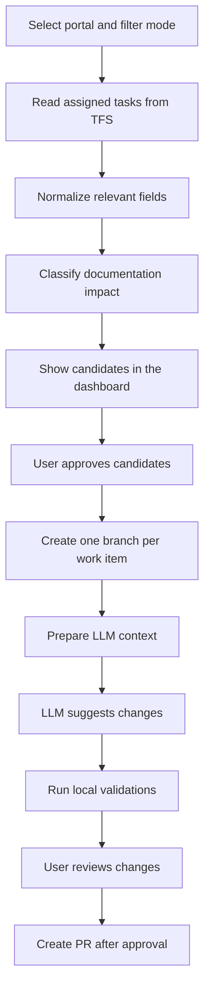

# TFS Documentation Automation MVP - Technical Design

## 1. Context

At the start of each sprint, a documentation team member follows the product team's planning session and validates which work items require new documentation, changes to existing documentation, or no documentation action. Many work items are small bugs or minor terminology changes where the manual validation cost is higher than the final documentation change.

The goal of this MVP is to create an LLM-assisted pipeline, using the tools available in the company environment, to reduce time spent on triage and on preparing small documentation changes.

## 2. MVP Goal

Create an isolated application, based on a copy of the Cherry Picks dashboard, that can:

1. Read tasks assigned to the Content team from TFS.
2. Present a filterable list of work items that may have documentation impact.
3. Classify each work item by likely documentation need.
4. Allow manual selection of candidates.
5. In a later MVP phase, prepare one branch per selected work item for LLM-assisted documentation changes.

The first phase must prioritize human control, traceability, and low operational risk.

## 3. Initial Non-Goals

The initial MVP must not:

- create PRs automatically without human approval;
- merge or cherry-pick changes;
- update work items in TFS;
- publish documentation;
- run LLM-generated changes directly in shared branches;
- assume that every work item needs documentation.

## 4. Cherry Picks Dashboard Reuse

The existing dashboard already provides useful components:

- TFS/Azure DevOps Server client;
- Windows Credentials and PAT authentication support;
- portal/repository configuration;
- PR and work item reads;
- simple Streamlit UI for internal operations.

The new project should gradually extract these responsibilities into clearer modules:

```text
tfs-doc-automation-mvp
  app.py                  inherited UI entry point, to be refactored
  tfs_dashboard.py        inherited TFS client, to be split into adapters
  config/
    tfs_dashboard.json    initial portal configuration
  docs/
    technical-design.md
```

## 5. Framework Decision

The project now uses FastAPI with server-rendered Jinja templates.

Reasons:

- direct write actions such as branch creation and draft PR creation fit better in an explicit request/response backend;
- it keeps the UI lightweight while giving full control over routes, forms, validation, and state transitions;
- it avoids the UX limits of Streamlit for row-level operational actions;
- it still keeps the implementation small enough for an internal MVP.

Current stack:

```text
Frontend: Jinja templates rendered by FastAPI
Backend: FastAPI
Persistence: SQLite
Integration: TFS/Azure DevOps Server REST API
Runtime configuration: .env
```

If the project later needs a richer client-side experience, the next likely step is:

```text
Frontend: React or Next.js
Backend: FastAPI
Jobs: Celery/RQ/APScheduler or an internal equivalent
Storage: SQLite for MVP, SQL Server/PostgreSQL for operational use
```

## 6. Proposed Functional Flow



## 7. Components

### 7.1 TFS Adapter

Responsibilities:

- authenticate against TFS;
- optionally resolve the current iteration from the development team board;
- fetch tasks assigned to configured Content team members;
- restrict candidate discovery to a configured development area path such as `Product\Development`;
- optionally pre-filter the assigned tasks by the current iteration;
- fetch full work item fields;
- fetch links to PRs, commits, or repositories when available.
- create branches and draft PRs in the target documentation repository.

Important separation:

- work item source: development team board (`work_item_project`, `work_item_team`), development area scope (`work_item_area_path`), and Content team member filters;
- target repository: documentation repository (`project`, `repository`).

Minimum fields per work item:

- ID;
- type;
- title;
- description;
- acceptance criteria;
- state;
- iteration path;
- area path;
- assigned to;
- tags;
- changed date;
- web URL.

### 7.2 Documentation Impact Classifier

Responsible for classifying work items before any repository change is attempted.

Initial categories:

- `No documentation needed`
- `Potential small doc update`
- `Needs human review`
- `Likely new documentation/tutorial`

Phased implementation:

1. simple rules based on type, tags, and keywords;
2. LLM-assisted classification;
3. combined rules + LLM + human feedback.

### 7.3 Repository Adapter

Responsibilities:

- locate a local clone or perform a controlled checkout;
- validate that the repository is in a clean state;
- create one branch per work item;
- run validation commands;
- prepare diffs for review;
- create PRs only after approval.

Suggested branch pattern:

```text
docs/wi-<id>-<short-title>
```

Example:

```text
docs/wi-123456-fix-api-timeout-term
```

### 7.4 LLM Agent Adapter

Responsible for encapsulating the available LLM tool. The project should not depend directly on one specific way of invoking Copilot.

Conceptual contract:

```text
input:
  - normalized work item
  - candidate files
  - editorial rules
  - safety constraints

output:
  - decision summary
  - changed files
  - proposed diff
  - confidence level
  - points requiring human review
```

For the automation pipeline, the agent must also write a local result file:

```text
.automation-context/copilot/<branch>/agent-result.json
```

Minimum fields:

```json
{
  "status": "green_light",
  "green_light": true,
  "summary": "Short explanation of the documentation update.",
  "changed_files": ["docs/example.md"]
}
```

The dashboard must not push or create a draft PR until this file is valid, green-lighted, and lists the files to commit. The context package lives at repository root level under `.automation-context/` rather than inside `.git`, because VS Code agents need to discover and read it as normal workspace content. The root `.automation-context/` folder is added to local `.git/info/exclude` so it remains a non-committed automation artifact.

This adapter can evolve to use:

- Copilot in VS Code;
- an internally approved CLI agent;
- another approved enterprise integration.

Manual prompt generation is useful for diagnosis, but it is not a valid implementation of the automated pipeline because it does not remove the reviewer from repetitive execution work.

### 7.5 Validation Runner

Responsible for running checks before any PR is created:

- documentation build;
- link validation;
- Markdown linting;
- repository instruction acknowledgement validation;
- local Markdown link and Mermaid `click` target validation for changed Markdown files;
- spell check, if available;
- snippet or example validation;
- changed files summary.

The MVP runs the lightweight checks before push. If a green-lighted agent result fails these checks, the item is moved to `needs_agent_fix` and the worker stops before committing, pushing, or creating a draft PR.

### 7.5.1 Automatic Agent Repair

The automatic runner treats the agent result as a contract, not just as a completion signal. A result is not allowed to progress to commit, push, or draft PR creation unless it has explicit green light, acknowledges all packaged repository instructions, and passes dashboard-managed validation.

When an active automatic flow receives a non-green result that still changed files, misses repository instruction acknowledgement, or fails preflight validation, the dashboard can launch one repair attempt on the same branch. This avoids losing useful agent work while still preventing unsafe progression.

The repair attempt:

- keeps the existing local branch and dirty working tree;
- removes the stale `agent-result.json` before relaunching the provider;
- reserves the repair attempt atomically before provider relaunch so duplicate workers cannot exceed the configured repair cap;
- reuses the original work item context package, repository instruction package, and reference-doc package;
- includes the previous result, changed files, and dashboard validation errors in the repair prompt;
- requires the agent to update the files as needed and rewrite `agent-result.json`;
- tracks `agent_repair_count`, `agent_repair_last_started_at`, and `agent_repair_last_reason` in local state.

The runner also waits for `agent-result.json` to remain stable for a short window before validating it. This is important for VS Code chat providers because the agent can write or rewrite the result file while the dashboard worker is polling in the background.

If the repair also fails, or the provider cannot be relaunched, the item moves to `needs_agent_fix` and automatic progression is disabled for that item until a reviewer intervenes or triggers a controlled rerun.

### 7.5.2 Controlled Reruns

A work item can be rerun when new information is added after a previous automation attempt or draft PR.

The rerun action:

- creates a new branch using the original generated branch name plus `-rerun-<timestamp>`;
- clears the local branch, agent, push, PR, and report state for the new attempt;
- marks the item as `rerun_active` so older PR links on the work item or parent do not block this intentional rerun;
- still detects PRs created from the new rerun branch;
- stores rerun final reports under a timestamp/branch-specific subfolder so earlier reports remain available on disk.

### 7.6 Automation Orchestrator

The orchestrator is responsible for durable progression of the pipeline after the initial user action:

- persists automatic-flow intent in SQLite before long-running work begins;
- periodically resumes unfinished flows after process restarts;
- polls `agent-result.json` until the agent reports a green-light result;
- advances from agent result to commit, push, and draft PR creation without browser interaction;
- links the created PR to the parent work item when a parent exists, falling back to the selected task otherwise;
- optionally discovers new open current-iteration work items and starts the full flow automatically when continuous mode is enabled.

For the MVP, the dashboard process starts an embedded runner and `run_worker.py` exposes the same loop for future service deployment. The long-term deployment shape should keep the dashboard as a control plane and run the orchestrator as a dedicated service process.

### 7.7 Approval Gate

No external action should happen without human approval in the early phases.

Suggested gates:

1. approve a work item as a candidate;
2. approve branch creation;
3. approve generated changes;
4. approve PR creation.

### 7.8 Runtime Settings

Runtime settings are stored in a local `.env` file and edited through the dashboard.

Current uses:

- server host and preferred port;
- automatic port fallback when the preferred port is not available;
- automation runner enablement and polling cadence;
- continuous-mode discovery cadence;
- Content team member discovery for assigned-task loading;
- default current-iteration-only filtering behavior;
- default reviewer identity;
- reviewer override mapping when work item identities need to resolve to specific PR reviewers.

## 8. Dashboard Work Item States

Suggested internal states for the MVP:

- `Discovered`
- `Classified`
- `Selected`
- `Branch Created`
- `LLM Drafted`
- `Validation Failed`
- `Ready For Review`
- `Approved For PR`
- `PR Created`
- `Skipped`

These states can initially be stored in a local JSON/SQLite store without writing to TFS.

## 9. Initial Persistence

For the MVP:

```text
data/
  automation-runs.sqlite
```

Main entities:

- automation run;
- analyzed work item;
- classification;
- human decision;
- created branch;
- validation runs;
- created PR, when applicable.

If the first phase should stay even simpler, start with local JSON and migrate to SQLite when run history becomes useful.

## 10. Security And Control

Baseline rules:

- do not store PAT values in files;
- never send secrets to the LLM;
- sanitize work item descriptions before building prompts if sensitive fields are present;
- keep auditable logs of decisions;
- create branches only in explicitly configured repositories;
- do not push or create PRs without an explicit human action;
- allow dry-run mode for all destructive or external operations.

## 11. MVP Roadmap

### Phase 1 - Discovery And Triage

- Create isolated UI.
- Reuse the existing TFS configuration.
- List tasks assigned to the Content team.
- Pre-filter tasks to the current sprint when desired.
- Show filters by type, state, tags, and area.
- Implement initial rules-based classification.
- Add branch planning and override controls.
- Add branch creation through TFS refs.
- Add draft PR creation with required reviewer assignment.

### Phase 2 - LLM-Assisted Classification

- Generate a structured prompt per work item.
- Get a suggested classification.
- Show a summarized rationale.
- Store human feedback to calibrate rules.

### Phase 3 - Branch And Context

- Configure target documentation repositories.
- Create one branch per selected work item.
- Identify candidate files using textual search and metadata.
- Prepare an LLM context package.

### Phase 4 - Change Drafting

- Run the LLM agent in an isolated branch.
- Show the diff and summary in the dashboard.
- Run validations.
- Mark items as ready for human review.

### Phase 5 - Assisted PR Creation

- Create a PR after approval.
- Associate the PR with the work item.
- Add standardized labels and description.
- Integrate with the existing review and cherry-pick workflow.

## 12. Risks

- Variable quality in LLM-generated changes.
- Work items with insufficient descriptions.
- Difficulty discovering the correct documentation files.
- Internal restrictions around automated Copilot usage.
- Risk of exposing sensitive information in prompts.
- Too much noise if the automation creates too many branches or PRs.

Mitigations:

- keep human gates;
- start with classification before repository changes;
- use dry-run by default;
- limit scope by portal/repository;
- record decisions and results;
- measure acceptance rate for suggestions.

## 13. Open Questions

- How should the current sprint be identified: configured iteration path, WIQL query, team settings, or manual selection?
- Which work item types should enter the MVP: Bug, Product Backlog Item, Task, User Story, or all?
- Which TFS fields provide the strongest documentation signal: tags, area path, acceptance criteria, description?
- Which approved Copilot or CM GPT integration can be invoked automatically while guaranteeing that proprietary work item content is processed only by the approved company model?
- Which documentation repositories should be targeted first: DocumentationPortal, DeveloperPortal, or both?
- Which validation commands already exist in the documentation repositories?

## 14. Recommended Next Step

Implement Phase 1:

1. Rename/refactor the copied UI so it no longer presents itself as a Cherry Pick dashboard.
2. Extract the TFS client into a reusable module.
3. Add a WIQL query for tasks assigned to Content team members.
4. Add optional current-sprint filtering on top of the assigned-task query.
5. Create a documentation triage table.
6. Store the initial classification locally.

This phase already provides value by reducing sprint-start triage effort without introducing operational risk in repositories or PRs.
